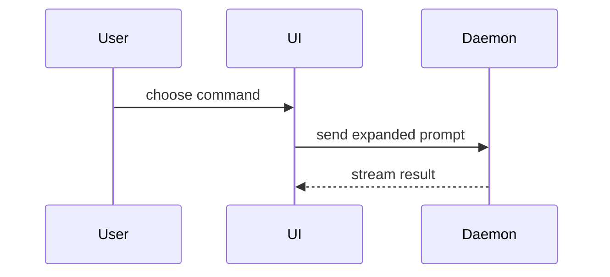

# HTML Communication

## When to Use

Use this skill for any request to produce a readable HTML artifact for a human, whether it is called a plan, spec, write-up, findings, summary, report, comparison, or set of UI mocks presented as readable HTML.

Do not use it for HTML that ships as part of a product.

## Document

Create one self-contained HTML file

- Write it like a spec, not a landing page: dense, scannable, no hero, decorative chrome, marketing voice, or em dashes.
- Vercel Dark Theme, Inter Font, Base font size: 18px (1rem); mọi thứ khác (typography, spacing, container,etc...) scale theo rem
- Make it mobile-readable with a responsive viewport and no fixed-width layout.
- Use semantic HTML, inline CSS, inline SVG, and HTTPS or data-URL images.
- HTML can have classic script only when interactivity materially helps. Keep scripted pages useful without JavaScript; the sandbox blocks storage, fetch, workers, frames, forms, and popups.
- In script-free files, give external links `target="_blank"` and `rel="noopener noreferrer"`. If any script exists, omit `target="_blank"`.

## UI Mocks/Visuals

When the user asks for variants:

- Render real styled variants, not descriptions.
- Label them `A`, `B`, `C`... for easy selection. Each tab per variant
- Lay them out for direct comparison.
- Keep one file across iterations.

## Rules
- Riêng file này được phép sử dụng hack/trick lỏ (vì không liên quan gì đến production, dev dùng để có tầm nhìn bao quát dễ theo dõi task/tiến độ)để đạt được mục đích: visual rõ ràng, dễ hiểu, non-boring, bề mặt đẹp và rõ ràng nhất cho dev hứng thú là dc. Nhưng vẫn cấm cài thư viện ngoài overkill
- Vietnamese Language Only
- Luôn luôn áp dụng Bro Unslop Ouput Style
- Đặt tên theo format: `{describe}-DD-MM-YYYY` (tự fill ý chính trong {describe})
- Nếu thuộc về project -> nằm riêng trong folder `html-visual` -> copy 2 file trong skill folder `assets/` vào `html-visual`
- Nếu không thuộc về project -> đọc 2 file trong skill folder `assets/` -> nhét thẳng toàn bộ vào 1 file html
- Luôn áp dụng `MASTER HTML SKELETON CHEAT SHEET`
- Default: luôn tạo file mới toanh, không sửa lại file đã tạo trừ khi được yêu cầu
- Tự bật html bằng(non-powershell): `$f=(Resolve-Path "<file>").Path; schtasks /create /sc once /st 23:59 /tn v /tr "cmd /c start msedge --new-window '$f'" /it /f; schtasks /run /i /tn v; Start-Sleep 1; schtasks /delete /tn v /f` + link `file:///`. không cần verify lại là đã bật chưa. cứ chạy là dc
- For a visual UI, layout, state comparison, or concept too dense for Mermaid, write a diagram, an infographic, or a short slide deck, whichever fits the point. Match the product's colors, type, spacing, and components; use real labels and data; support desktop and mobile.

### Design
- Layout & Max-Width: Container 80rem / Base 18px
- Áp dụng Icon/Emoji, màu sắc cho rõ ràng, thú vị, playful, non-boring
- Dùng divider để ngăn cách rõ ràng giữa các phần với nhau (2 cột thường đi chung là 1 phần của nhau)
- Không dùng chữ muted
### Tab Summarize (Default):
- Nếu có nhiều hơn 1 task/yêu cầu/vấn đề/thông tin/phương án/ý tưởng/câu hỏi/etc... thì hãy cứ nhét hết vào (ví dụ: 2 task -> 6 cards tương ứng (vì 1 task là 3 cards))
- (có thể có nhiều hơn 1 nhưng)1 task/yêu cầu/vấn đề/thông tin/phương án/ý tưởng/câu hỏi/etc... phải có những Card theo thứ tự sau:
1. Card Visual before(trái)/after(phải) dạng Comparison Slider (Swipe Diff) User có thể kéo trượt Drag & Drop qua lại để so sánh trực tiếp. Border màu trắng. content 2 bên phải giữ nguyên 100% width không bị reflow khi kéo slider (clip-path, CROP not RESIZE)
2. Card Bản `Before` Only, Ưu tiên Interactive nếu có thể. Border Card màu đỏ
3. Card Bản `After` Only, Ưu tiên Interactive nếu có thể. Border Card màu xanh lục
- ONLY ALWAYS Show use case có visual ở cả 3 Cards(Card 1 chỉ là bản copy paste của 2 Cards kia) mà bất kì người thường nào nhìn cũng thấy rõ/hiểu sự khác biệt (không khó hiểu, không technical). Ít text phân tích nhất có thể (Annotation hay Text gốc nằm trong nội dung của Visual thì không tính)
- Trong trường hợp nếu có sẵn ảnh hoặc nếu dùng ảnh làm visual thì sẽ hiệu quả hơn? -> dùng nó
- `🗣️ TÓM LƯỢC & Ý CHÍNH 🗣️` Respond only, đặt trong Callout, center. `max-width`: 40rem
#### Mockup Visual
- Mỗi Card: `min-height: 20rem`, `padding: 1rem 1.25rem 3rem`, `overflow: visible`
- Direct Annotation: Viền dashed (dùng color phù hợp) + tag mini cắm thẳng trên visual ở tất cả các Card(đồng bộ consistant tag)
- Inspector Toggle:  `[ 🔍 Check Diff ]`:`position: fixed`; `bottom: 1.5rem`; `right: 1.5rem` : ON(default): Hiện viền, tag. OFF: Ẩn

### Tab Explain:
- Nếu phải explain những thứ không liên quan đến code thì vẫn hãy cứ tuân thủ theo `Zoom-in principle`, 
- 2 cột ngang nhau là 1 phần và phải đi kèm lẫn nhau, 1 bên nói 1 bên show, có ngăn cách divider giữa các phần rõ ràng.
- Cột trái: Text Explain: 30rem
- Gap giữa 2 cột: 2rem
- Cột phải: Visual Show: 48rem
#### Coding Explain
- Cột phải: CẤM dồn 1 dòng & cấm văn xuôi; mỗi bước 1 dòng thụt lề 2-space + icons 📁📄; Vercel dark, syntax highlight, pre-wrap cấm scroll ngang, diff viền trái border-left.
##### Zoom-in principle (Coding version)
- Trình bày từ tầng cao nhất xuống thấp, áp dụng diffs nếu cần
1. Folder level
2. File & Components level 
3. Function & Call Tree level 
4. Algorithm & Logic level (pseudocode)

####

Help the user understand the current topic of conversation visually. Skip the preamble and keep prose brief. Pick the smallest view that makes the key point clear. Remember to rewrite in html format (NOT markdown)

- Show logic or an algorithm as pseudocode:

```text
on(save)
  if content is unchanged
    return cached result
  write new content
  return fresh result
```

- Show runtime control flow as a call tree:

```text
submitForm
  createSession
    persistPrompt
    launchAgent
  navigateToSession
```

- Show UI structure as a component tree, including state and module boundaries that matter:

```tsx
<SessionPage> (apps/example/src/routes/session.tsx)
  useSessionEvents()
  <SessionToolbar>
    <RunSkillButton> (packages/ui)
```

- Show file responsibility or a broad refactor as a shallow file tree:

```text
src/
├── commands/       # parses user actions
├── sessions/       # owns session state
└── transport/      # sends API requests
```

- Show component interaction, control flow, or data flow with Mermaid:



- Use `diff` when the point is what changes and the surrounding shape already exists. Match the diff shape to the topic.

For a component change:

```diff
 <SessionPage>
   useSessionEvents()
   <SessionToolbar>
+    <RunSkillButton />
   <SessionTimeline>
+    <SkillResultCard />
```

For a file-layout change:

```diff
 src/
 ├── commands/
+│   └── show-me.ts       # expands the slash command
 ├── sessions/
-└── transport.ts
+└── transport/
+    ├── client.ts
+    └── stream.ts
```

For a call-tree or call-stack change:

```diff
 submitForm
   createSession
     persistPrompt
+    expandSkillMention
     launchAgent
-  navigateToSession
+  navigateToSession
+    subscribeToEvents
```

For a state or control-flow change:

```diff
 on(save)
-  write content
+  if content is unchanged
+    return cached result
+  write new content
+  invalidate cache
```

- Show the whole block when most of it is new, when omitted context would hide ownership or order, or when the user needs a copyable target shape:

```ts
function expandSkill(command: string): string {
  const skillName = command.slice(1)
  return `use the ${skillName} skill`
}
```
### guidance

Place each visual next to the short text it supports. Keep only the calls, files, props, states, and boundaries needed to answer the user's current question or the options to resolve the current discussion point.

# MASTER HTML SKELETON CHEAT SHEET (Hãy thông minh tùy biến theo input của user, ví dụ: Thêm Card/Tabs nếu input quá nhiều thứ)

```html
<!DOCTYPE html>
<html lang="vi">
<head>
  <meta charset="UTF-8">
  <meta name="viewport" content="width=device-width, initial-scale=1.0">
  <title>Bản Thiết Kế: TÊN_TASK</title>

  <!-- DUAL-MODE AUTO DETECT:
       - Nếu nằm trong project: dùng link tới ./visual-core.css
       - Nếu standalone ngoài project: nhúng toàn bộ nội dung visual-core.css vào thẻ <style> -->
  <link rel="stylesheet" href="./visual-core.css">

  <style>
    /* CSS Mockup đặc thù của task (giữ ngắn gọn, ưu tiên < 80 dòng) */
  </style>
</head>
<body>

  <!-- 1. STICKY TOPBAR (Luôn nổi ở nóc, z-index: 1100) -->
  <header class="nav-header">
    <div class="brand-title"><span>⚡</span> BẢN THIẾT KẾ: TÊN_TASK</div>
    <nav class="tab-group" role="tablist">
      <button class="tab-btn active" role="tab" aria-selected="true" onclick="switchTab('summarize')">📌 Tóm Lược</button>
      <button class="tab-btn" role="tab" aria-selected="false" onclick="switchTab('explain')">🔍 Giải Thích Chi Tiết</button>
    </nav>
  </header>

  <div class="container">
    <!-- =================================================================
         TAB 1: TÓM LƯỢC (DEFAULT) - CHUẨN 3 CARDS THỊ GIÁC
         ================================================================= -->
    <main id="tab-summarize" class="tab-pane">
      <section class="callout">
        <h2>🗣️ TÓM LƯỢC &amp; Ý CHÍNH 🗣️</h2>
        <p>1 câu ngắn gọn đắt giá nhất truyền tải toàn bộ bức tranh toàn cảnh...</p>
      </section>

      <!-- CARD 1: COMPARISON SLIDER (CSS GRID STACK - NATIVE ANTI-CUTOFF) -->
      <article class="card-wrapper card-slider">
        <div class="card-header-bar">
          <span class="card-badge badge-white">CARD 1: COMPARISON SLIDER</span>
          <span style="font-size: 0.85rem; color: #ffffff;">Kéo trượt để so sánh Trước / Sau</span>
        </div>
        <div class="slider-viewport">
          <!-- Layer Before (Tự động neo chiều cao chuẩn) -->
          <div class="slider-layer slider-before">
            <!-- Mockup Trước đó -->
          </div>
          <!-- Layer After (Phủ cùng grid-area: 1 / 1, crop bằng clip-path) -->
          <div class="slider-layer slider-after">
            <!-- Mockup Sau đó -->
          </div>
          <!-- Divider & Knob bắt cảm ứng chuột/vuốt mượt 60fps -->
          <div class="slider-divider">
            <div class="slider-knob">⇄</div>
          </div>
        </div>
      </article>

      <!-- CARD 2: BEFORE ONLY (Hiện trạng lỗi/nhược điểm) -->
      <article class="card-wrapper card-before">
        <div class="card-header-bar">
          <span class="card-badge badge-red">CARD 2: BEFORE ONLY</span>
          <span style="font-size: 0.85rem; color: #fca5a5;">Mô tả nhược điểm cũ</span>
        </div>
        <!-- Mockup Trước -->
      </article>

      <!-- CARD 3: AFTER ONLY (Giải pháp mới hoàn thiện) -->
      <article class="card-wrapper card-after">
        <div class="card-header-bar">
          <span class="card-badge badge-green">CARD 3: AFTER ONLY</span>
          <span style="font-size: 0.85rem; color: #86efac;">Có nút bấm tương tác thật</span>
        </div>
        <!-- Mockup Sau -->
      </article>
    </main>

    <!-- =================================================================
         TAB 2: GIẢI THÍCH CHI TIẾT (4 TẦNG ZOOM-IN 2 CỘT)
         ================================================================= -->
    <section id="tab-explain" class="tab-pane" style="display: none;">
      <!-- Lặp lại explain-section cho từng tầng: VĨ MÔ -> UI -> RUNTIME -> LOGIC -->
      <section class="explain-section">
        <div class="explain-layout">
          <!-- Cột Trái (30rem sticky) -->
          <div class="explain-text-col">
            <div class="zoom-tier-badge">TẦNG 1/4 • VĨ MÔ</div>
            <h3>📁 1. Cấu Trúc Thư Mục</h3>
            <p>Mô tả súc tích bản chất thay đổi kiến trúc...</p>
            <div class="meta-tag-group">
              <span class="meta-tag green">Mới</span>
              <span class="meta-tag blue">Module</span>
            </div>
          </div>

          <!-- Cột Phải (48rem code frame, pre-wrap cấm scroll ngang) -->
          <div class="code-container">
            <div class="code-topbar">
              <div class="code-topbar-left">
                <div class="code-dots">
                  <span class="code-dot red"></span><span class="code-dot yellow"></span><span class="code-dot green"></span>
                </div>
                <!-- Dropdown File Path & IDE launcher -->
                <div class="file-dropdown-wrapper">
                  <button class="file-dropdown-trigger" type="button" aria-haspopup="menu" aria-expanded="false" onclick="toggleFileDropdown(this)">
                    <span>📁 src/auth/</span><span class="chevron">▼</span>
                  </button>
                  <div class="file-dropdown-menu">
                    <div class="file-dropdown-header"><span>TẬP TIN</span><span>DIR</span></div>
                    <a class="file-dropdown-item ide" href="vscode://file/C:/path/to/file">Mở trong VS Code</a>
                    <button class="file-dropdown-item path" type="button" onclick="copyFilePath('src/auth/session.ts')">Sao chép đường dẫn</button>
                  </div>
                </div>
              </div>
              <div class="code-actions">
                <span class="diff-stat"><span class="stat-add">+12</span> <span class="stat-del">-4</span></span>
                <!-- Preset ngôn ngữ: structure | ts | tsx | rust | go | py | flow | logic -->
                <span class="code-lang-badge"><span class="lang-dot structure"></span> STRUCTURE</span>
                <button class="btn-copy-code" type="button" onclick="copyCodeBlock(this)">Sao chép</button>
              </div>
            </div>

            <!-- Khối Code Từng Dòng + Syntax Highlight -->
            <div class="code-body">
              <div class="c-line"><span class="c-sign"></span><span class="c-text"><span class="tg">├── </span>📁 src/</span></div>
              <div class="c-line add"><span class="c-sign">+</span><span class="c-text">  <span class="kwd">const</span> <span class="prop">session</span> = <span class="fn">createSession</span>();</span><span class="c-comment"># thêm session mới</span></div>
              <div class="c-line del"><span class="c-sign">-</span><span class="c-text">  <span class="fn">oldLegacyHandler</span>();</span><span class="c-comment"># bỏ logic cũ</span></div>
            </div>
          </div>
        </div>
      </section>
    </section>
  </div>

  <!-- Nút Inspector Toggle Fixed (Tự động ẩn/hiện theo sự xuất hiện của Diff) -->
  <button id="inspector-toggle" onclick="toggleDiff()">
    <span>🔍 Check Diff</span>
    <span id="diffStatusTag">[BẬT]</span>
  </button>

  <!-- DUAL-MODE AUTO DETECT:
       - Nếu nằm trong project: dùng script src="./visual-core.js"
       - Nếu standalone ngoài project: nhúng toàn bộ nội dung visual-core.js vào thẻ <script> -->
  <script src="./visual-core.js"></script>
</body>
</html>
```
